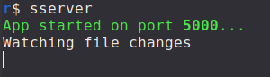

### A simple static web server. Supports HMR, Made to be used mostly locally

### This server is meant to serve static files only

### HTML, CSS, JS (No framework support for now)

## Getting Started

First, install globally:

```bash
npm i -g sweet-server
```

Go to your project root directory and start the server there

```bash
sserver
```



## Options

| Option         | Argument                                            | Default |
| -------------- | --------------------------------------------------- | ------- |
| `-p, --port`   | Specify which port sserver should run on e.g `4001` | `6001`  |
| `-m, --mode`   | Specify server reload mode `hmr` or `no-hmr`        | `hmr`   |
| `-g, --global` | Save other passed options as default                |         |
| `-h, --host`   | Access your application over local network          |         |

Open [http://localhost:6001](http://localhost:6001) with your browser to see the result.

You can start editing the page by modifying any file in your app directory. The page auto-updates as you edit the file.

## Cleanup side effects during invalidation

To cleanup side effects that might keep running after invalidation e.g setTimeout

create a function named \__sserver_cleanup_`${module}` containing how to cleanup side effect and sserver will call it automatically

# How it works

```ts
const module = change.replace("/", "").replace(".js", "");
const cleanup = `__sserver_cleanup_${module}`;
typeof (window as any)[cleanup] !== "undefined" &&
  await(window as any)[cleanup]();
```

# TODO

- Add a way to persist state between replacements
- Typescript support
- fallback for wrong directory
- option to specify working directory
